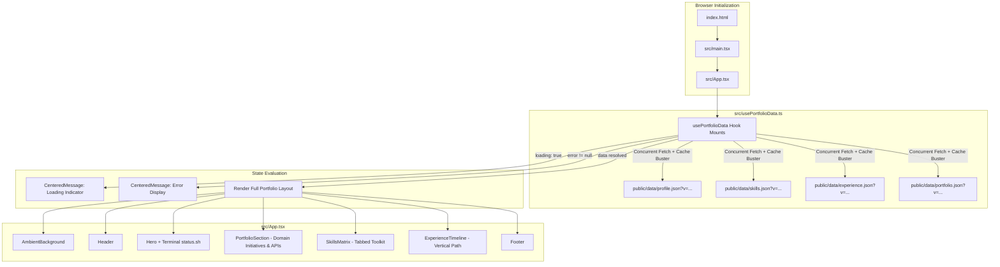

# Dharmesh Patel Portfolio — Architecture & Codebase Flow

This document provides a comprehensive technical overview of the architecture, data lifecycle, UI components, styling system, and deployment workflow for the portfolio application.

---

## 1. Project Overview

The portfolio is a lightweight, responsive, single-page application built for **Dharmesh Patel** (Senior Full-Stack Engineer & Team Lead).

### Key Architectural Characteristics
- **Decoupled Content Architecture**: All dynamic resume data (profile info, skills matrix, career timeline, and domain-driven portfolio initiatives) is maintained in static JSON files under `public/data/` rather than hardcoded into React components.
- **Zero-Rebuild Content Updates**: Because content is fetched at runtime by the browser, updating resume text on production hosting (e.g. AWS S3) does not require rebuilding or redeploying the JavaScript bundle.
- **Cache Invalidation on Static Hosting**: JSON requests include a dynamic timestamp parameter (`?v=<timestamp>`) ensuring that visitors always receive fresh data without CDN/browser cache delays.

---

## 2. Technology Stack

| Layer | Technology | Purpose |
| :--- | :--- | :--- |
| **Framework** | [React 18](https://react.dev/) | Component-based UI library |
| **Language** | [TypeScript 5](https://www.typescriptlang.org/) | Type safety and interface contracts |
| **Build Tool** | [Vite 5](https://vitejs.dev/) | Fast HMR dev server & optimized Rollup production builds |
| **Styling** | [Tailwind CSS v3](https://tailwindcss.com/) + PostCSS | Utility-first styling with custom cyber-glow design tokens |
| **Typography** | Google Fonts (`Space Grotesk`, `Inter`, `JetBrains Mono`) | Modern aesthetic pairing display, body, and monospace typography |

---

## 3. Directory Structure

```text
portfolio/
├── .gitignore                    # Git ignored files (node_modules, projects, .agent, dist)
├── document/
│   └── architecture_and_flow.md  # Comprehensive architecture & flow documentation
├── index.html                    # Root HTML document, meta tags & Google Fonts CDN
├── package.json                  # Dependencies and build scripts
├── postcss.config.js             # PostCSS configuration (TailwindCSS, Autoprefixer)
├── tailwind.config.js            # Custom design tokens, theme extensions, animations
├── tsconfig.json                 # TypeScript compiler options
├── vite.config.ts                # Vite configuration with @vitejs/plugin-react
├── public/
│   └── data/
│       ├── profile.json          # Personal information, title, location, contacts, bio
│       ├── skills.json           # Categorized skill tags (AI Governance, Frontend, Backend, etc.)
│       ├── experience.json       # Career history with roles, companies, bullets
│       └── portfolio.json        # Domain-categorized initiatives, integrations, and projects
└── src/
    ├── main.tsx                  # React DOM root entry point
    ├── App.tsx                   # Main layout and UI component tree
    ├── types.ts                  # TypeScript interfaces for data models
    ├── usePortfolioData.ts       # Concurrent data fetching custom React hook
    ├── index.css                 # Base Tailwind directives, focus rings & scrollbars
    └── vite-env.d.ts             # Vite environment typings
```

---

## 4. Application Flow & Data Lifecycle



---

## 5. Domain Specializations (`portfolio.json`)

The portfolio is structured into 8 distinct industry domains:
1. **Enterprise AI Governance, LLM Firewalls & Agentic Workspaces**:
   - High-Performance AI Governance Middleware & Security Firewall (8-layer pipeline, PII/NER redaction, multi-LLM routing, SHA256 audit logs).
   - Institutional GenAI SaaS Workspace & Multi-Tenant Control Plane (Master/Tenant DB isolation, 12-step automated onboarding, 120+ REST APIs, Redis caching).
2. **Digital Out-of-Home (DOOH) & Smart Kiosk Infrastructure**:
   - Multi-Tenant DOOH Advertising & Display Kiosk Backend (Sequelize master/tenant migrations, sub-millisecond campaign delivery).
3. **Fintech, NBFC & Digital Banking**:
   - Enterprise Salary Advance Platform, SME Working Capital Solution, Multi-Tenant Retail Brand Settlement Hub.
4. **Regulated Logistics & Delivery Management**:
   - Regulated Delivery Logistics & Compliant Inventory Platform (White-label PWA & Elasticsearch).
5. **Automotive Dealership & Digital Solutions**:
   - Automotive Dealership Inventory & SEO Marketing Suite, Digital Automotive Marketplace.
6. **E-Commerce, Custom Portals & MLM Systems**:
   - Custom Apparel Commerce & Multi-Tier Stylist MLM Engine, Multi-Vendor Marketplace.
7. **Crowdfunding & Donation Platforms**:
   - Global Crowdfunding & Multi-Tier Donor Pledge Engine.
8. **Sports Tech, Social Communities & Streaming**:
   - Real-Time Multi-League Sports Prediction Platform, Live Video Streaming & Community Marketing, Smart Co-Working Space Booking.

---

## 6. Build & Deployment Guidelines

### Local Development
```bash
npm install
npm run dev
```

### Production Build
```bash
npm run build
```
Generates a static `dist/` directory ready for any static web host.

### Hosting on AWS S3 & CloudFront
1. Sync `dist/` to an S3 bucket configured for static website hosting:
   ```bash
   aws s3 sync dist/ s3://YOUR-BUCKET-NAME --delete
   ```
2. To update content, upload modified JSON files to the S3 bucket's `data/` folder directly without rebuilding the entire app.
