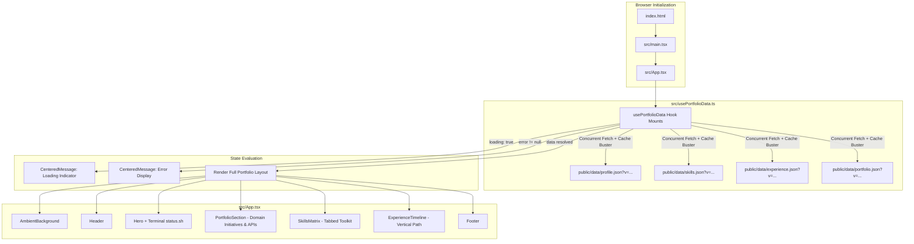

# Dharmesh Patel Portfolio — Architecture & Codebase Flow

This document provides a comprehensive technical overview of the architecture, data lifecycle, UI components, styling system, and deployment workflow for the portfolio application.

---

## 1. Project Overview

The portfolio is a lightweight, responsive, single-page application built for **Dharmesh Patel** (Senior Full-Stack Engineer & Team Lead).

### Key Architectural Characteristics
- **Decoupled Content Architecture**: All dynamic resume data (profile info, skill categories, work history, and industry domain project initiatives) is maintained in static JSON files under `public/data/` rather than hardcoded into React components.
- **Zero-Rebuild Content Updates**: Because content is fetched at runtime by the browser, updating resume text on production hosting (e.g. AWS S3) does not require rebuilding or redeploying the JavaScript bundle.
- **Cache Invalidation on Static Hosting**: JSON requests include a dynamic timestamp parameter (`?v=<timestamp>`) ensuring that visitors always receive fresh data without CDN/browser cache delays.

---

## 2. Technology Stack

| Layer | Technology | Purpose |
| :--- | :--- | :--- |
| **Framework** | [React 18](https://react.dev/) | Component-based UI library |
| **Language** | [TypeScript 5](https://www.typescriptlang.org/) | Type safety and interface contracts |
| **Build Tool** | [Vite 5](https://vitejs.dev/) | Fast HMR dev server & optimized Rollup production builds |
| **Styling** | [Tailwind CSS v3](https://tailwindcss.com/) + PostCSS | Utility-first styling with custom cyber-glow design tokens |
| **Typography** | Google Fonts (`Space Grotesk`, `Inter`, `JetBrains Mono`) | Modern aesthetic pairing display, body, and monospace typography |

---

## 3. Directory Structure

```text
portfolio/
├── .gitignore                    # Git ignored files (node_modules, projects, .agent)
├── document/
│   └── architecture_and_flow.md  # Comprehensive architecture & flow documentation
├── index.html                    # Root HTML document, meta tags & Google Fonts CDN
├── package.json                  # Dependencies and build scripts
├── postcss.config.js             # PostCSS configuration (TailwindCSS, Autoprefixer)
├── tailwind.config.js            # Custom design tokens, theme extensions, animations
├── tsconfig.json                 # TypeScript compiler options
├── vite.config.ts                # Vite configuration with @vitejs/plugin-react
├── public/
│   └── data/
│       ├── profile.json          # Personal information, title, location, contacts, bio
│       ├── skills.json           # Categorized skill tags (Frontend, Backend, Cloud, etc.)
│       ├── experience.json       # 5-stage career history with roles, companies, bullets
│       └── portfolio.json        # Domain-categorized initiatives, integrations, and projects
└── src/
    ├── main.tsx                  # React DOM root entry point
    ├── App.tsx                   # Main layout and UI component tree
    ├── types.ts                  # TypeScript interfaces for data models
    ├── usePortfolioData.ts       # Concurrent data fetching custom React hook
    ├── index.css                 # Base Tailwind directives, focus rings & scrollbars
    └── vite-env.d.ts             # Vite environment typings
```

---

## 4. Application Flow & Data Lifecycle



### Flow Walkthrough

1. **Bootstrap (`index.html` -> `main.tsx`)**:
   - `index.html` loads the required web fonts and defines `<div id="root"></div>`.
   - `main.tsx` mounts the root React component `<App />`.

2. **Data Ingestion (`usePortfolioData.ts`)**:
   - On component mount (`useEffect`), the hook runs `Promise.all` fetching the 4 JSON endpoints simultaneously: `profile.json`, `skills.json`, `experience.json`, and `portfolio.json`.
   - Appends `?v=${Date.now()}` to bypass HTTP caches.
   - Includes a cleanup flag (`cancelled = true`) to prevent memory leaks and state updates if unmounted before completion.

3. **State Rendering (`App.tsx`)**:
   - **Loading State**: Displays loading indicator with the animated ambient background.
   - **Error State**: Displays descriptive error feedback if any JSON file fails to load or parse.
   - **Success State**: Passes loaded data objects down to the respective layout components.

---

## 5. UI Components Breakdown

### 1. `AmbientBackground`
- Fixed backdrop with dark background (`bg-slate-950`).
- Generates a subtle cyber-grid pattern (`bg-cyber-grid`) with radial opacity masking.
- Multi-layer blurred ambient glow orbs in Indigo and Sky blue (`blur-[120px]`).

### 2. `Header`
- Sticky top navigation bar with translucent blur effect (`backdrop-blur-xl`).
- Dynamic pulsing availability status badge (emerald beacon).
- Navigation anchors (`#portfolio`, `#stack`, `#timeline`, `#contact`) and direct quick-contact phone button.

### 3. `Hero`
- Location indicator badge, bold display heading, and career summary excerpt.
- Email and phone action badges with hover animations.
- **Terminal Status Readout (`status.sh`)**: Interactive mock terminal card showing `$ whoami`, `$ uptime`, and `$ status` with a blinking cursor.

### 4. `PortfolioSection`
- **Domain Filter Tabs**: Interactive selector across 6 industry domains (Fintech & Banking, Logistics & Cannabis, Automotive, E-Commerce, Crowdfunding, Sports Tech).
- **Specialization Banner**: Displays domain tagline, key initiative count, and engineering scope summary.
- **Project Cards**: Rich cards with title, company, duration, role, full description, architecture highlights, tech stack tags, and specialized **APIs & Integrations** badges (e.g. Kotak API, Equifax/Experian, Elasticsearch, Razorpay, QuickBooks, Authorize.Net).

### 5. `SkillsMatrix`
- Dynamic category tab selector derived from the keys of `skills.json`.
- Grid of interactive technology badges with hover translation and glow accents.

### 6. `ExperienceTimeline`
- Vertical timeline with continuous gradient connector line.
- Glowing timeline nodes marking each milestone across all 5 career positions.
- Cards detailing role title, company name, location, dates, and bullet achievements.

### 7. `Footer`
- High-contrast direct email callout and copyright notice with dynamic year calculation.

---

## 6. Data Models & JSON Schema

All TypeScript types are declared in `src/types.ts`:

### Profile (`public/data/profile.json`)
```typescript
export interface Profile {
  name: string;
  title: string;
  location: string;
  mobile: string;
  email: string[];
  summary: string;
}
```

### Portfolio Projects & Domains (`public/data/portfolio.json`)
```typescript
export interface ProjectItem {
  name: string;
  company?: string;
  duration?: string;
  role?: string;
  description: string;
  technologies: string[];
  integrations?: string[];
  highlights?: string[];
  link?: string;
}

export interface DomainSection {
  id: string;
  domain: string;
  icon?: string;
  tagline: string;
  summary: string;
  featuredProjects: ProjectItem[];
}
```

### Skills Matrix (`public/data/skills.json`)
```typescript
export type SkillMatrix = Record<string, string[]>;
```

### Experience (`public/data/experience.json`)
```typescript
export interface ExperienceEntry {
  role: string;
  company: string;
  location: string;
  period: string;
  bullets: string[];
}
```

---

## 7. Build & Deployment Guidelines

### Local Development
```bash
npm install
npm run dev
```

### Production Build
```bash
npm run build
```
Generates a static `dist/` directory ready for any static web host.

### Hosting on AWS S3 & CloudFront
1. Sync `dist/` to an S3 bucket configured for static website hosting:
   ```bash
   aws s3 sync dist/ s3://YOUR-BUCKET-NAME --delete
   ```
2. To update content, upload modified JSON files to the S3 bucket's `data/` folder directly without rebuilding the entire app.
